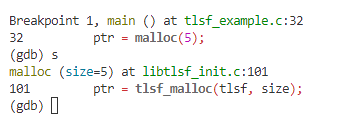

# LIBTLSF Example

This folder contains examples of how to use the TLSF library


## Prerequisites

Before compiling and running the examples, make sure you have built the TLSF library (`libtlsf.so`) and added the TLSF source directory containing the shared object to the Linux dynamic linker search path.

To compile TLSF, Run `make` in [src/](../src/):

```
cd ../src
make
```

To add the TLSF source directory containing the resulting shared object to the dynamic linker search path set the `LD_LIBRARY_PATH` environmental variable to include the [src/](../src/) directory:

```
export LD_LIBRARY_PATH='/path/to/tlsf/src'
```


## Building and running the TLSF example

To build examples, run `make` in the [example/](./example/) directory:

```
cd ../example
make
```
If `libtlsf.so` can be found in the dynamic linker search path, the resulting example executable can be tested as indicated below using gdb.

## Compiling with CHERI
To compile this example for the CHERI architecture, set the `CHERI` variable to 1 during compilation:
```
gmake CHERI=1
```
> [!IMPORTANT]
> Use `gmake` to compile, not `make`.

### Debuging with GDB 

Start the gdb debugger and load the `tlsf_example` executable:

```
gdb tlsf_example
```
Inside the gdb console, set a breakpoint at line 32 of `tlsf_example.c` where the malloc function is called:
```
break tlsf_example.c:32
```
Run the `tlsf_example` program using the run command:
```
run
```
When the program reaches the breakpoint, use the step command to step through the code. The expected output, malloc() should call `tlsf_malloc()`. 

```
step
```
GDB Output

